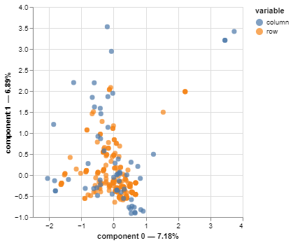

# BlackPeak-Assessment

- EDA, MCA, Modelling steps are in assesment.ipynb file
- Streamlit app developed in webapp.ipynb file and created app.py file
- LLM app codes in llm_app.ipynb file

## Task 1
Perform exploratory data analysis and select three key plots, explain your takeaways.
Please note that there is no need to explain how you have generated your plots, only
the inference and findings need to be explained.

All plots are in plot folder. (Didn't add all here because of plot size)

##### **Regplot Insights:**

Strong Predictors of Price:
- Engine-size, horsepower, curb-weight (strong positive relationships).
- Highway-mpg (strong negative relationship).
  
Weak Predictors of Price:
- Stroke, peak-rpm (weak correlations).

Outliers:
- Some plots show outliers that might distort the regression relationships. These should be investigated further to ensure model robustness.

##### **Boxplot Insights:**
Insights:
- Luxury Segments: Categories like rear engine, rwd, convertible, and manufacturers like bmw, mercedes-benz, and porsche dominate the high-price range.
- Economy Segments: Features like fwd, gas, and brands like toyota and honda are associated with lower prices.
- Performance Indicators: Higher number-of-cylinders, turbo aspiration, and certain engine types are strongly tied to high prices.

##### **Correlation Insights**:
- Important Predictors: engine-size, horsepower, curb-weight, width, and length should be considered key features for predicting price.
Fuel efficiency metrics (city-mpg and highway-mpg) are also critical due to their strong negative correlation with price.
- Less Relevant Features: normalized-losses, stroke, and compression-ratio have weak correlations with price and may contribute less to the model.
- Feature Engineering: Derive a feature like power-to-weight ratio (horsepower / curb-weight) to capture combined effects of performance and weight.
Cluster vehicles into categories (e.g., economy, mid-range, luxury) and analyze price drivers within each segment.
- Multicollinearity: High correlations among predictors like engine-size, horsepower, and curb-weight suggest potential multicollinearity. Consider techniques like Ridge or Lasso regression to handle this.


## Task 2:
Perform multiple correspondence analysis (MCA) on the dataset and briefly describe
your findings.



**MCA Results**
- Even with 5 dimensions, only 30.21% of the variance in categorical data is captured, indicating a highly dispersed dataset.

**Clustering:** Rows were grouped into 5 clusters using the first 5 dimensions, revealing distinct groups based on categorical profiles.

**Key Insights:**

Clusters showed clear differences in average price and categorical features (e.g., body style, fuel type).
The first two dimensions highlight dominant patterns but miss a large portion of the variability.

## Task 3:
Build a model for predicting the price of the automobile. Explain your choices on
encoding, model selection etc.

Cross-Validation Results
|    | Model                 |     MAE |    RMSE |     MAPE |       R2 |
|---:|:----------------------|--------:|--------:|---------:|---------:|
|  0 | LGBMRegressor         | 1982.9  | 3165.78 | 0.137853 | 0.828875 |
|  1 | LinearRegression      | 1564.82 | 2079.89 | 0.12853  | 0.927532 |
|  2 | RandomForestRegressor | 1447.16 | 2129.62 | 0.106151 | 0.919367 |
|  3 | Ridge                 | 1606.62 | 2133.24 | 0.135246 | 0.925308 |
|  4 | XGBRegressor          | 1622.55 | 2372.16 | 0.116604 | 0.901892 |


**Feature Scaling**
- RobustScaler: Applied to highly skewed features to reduce the impact of outliers (e.g., engine-size, compression-ratio, horsepower).
- StandardScaler: Used for features with approximately normal distributions to ensure consistent scaling across numerical columns.
These choices ensured that features were on comparable scales, improving the performance of models sensitive to feature magnitudes.

**Cross-Validation**
- Used stratified cross-validation to evaluate multiple models, ensuring consistent target distribution across folds.
This approach provided a robust assessment of model performance across different subsets of the data.

**Model Selection**
- Evaluated several regression models, including Linear Regression, Ridge, RandomForestRegressor, XGBRegressor, and LGBMRegressor.
- Metrics such as MAE, RMSE, MAPE, and R² were used for comparison.

- **RandomForestRegressor** was chosen as the final model due to its:
  - Consistently low error metrics (MAE, RMSE).
  - High R², indicating it explained the most variance in the target variable.
  - Robustness to outliers and ability to capture non-linear relationships.

**Encoding**
- Applied one-hot encoding for categorical variables, ensuring compatibility with tree-based models and improving interpretability.

## Task 4 A (High-Level Plan of Action)
Explain the high-level plan of action if the above model is to be used as the backend
for a web application for B2B use at an automobile manufacturing firm. Please write
in bullet points the steps needed and explain your technological choices.

### High-Level Plan of Action
**Step 1: ETL**
- Create an ETL (Extract, Transform, Load) pipeline for handling incoming data.
    - Use Apache Airflow or AWS Glue for the ETL pipeline.
- Automate data validation to ensure input matches the model's training structure.

**Step 2: Model Serialization and Storage**
- Serialize the trained pipeline using joblib or pickle. Store the serialized model in a cloud storage service, such as AWS S3, Azure Blob Storage, or Google Cloud Storage.

**Step 3: Deployment as API**
- Deploy the model as a REST API for easy integration with the web application. (Use FastAPI or Flask to create the API backend.)

**Step 4: WebApp**
- Integrate the REST API with a user-friendly front-end application. (django)
- Create endpoints for submitting car features and retrieving price predictions.
- Design an intuitive UI tailored for B2B users (e.g., pricing analysts at automobile firms).

**Step 5: Model Monitoring**
- Monitor model performance for data drift and prediction accuracy over time.
- Automate retraining of the model using updated data from the web application.

## Task 4 B (Streamlit App)
Bonus points if you can make an actual web application using MLFlow, Streamlit (or any
framework of your choice) which takes key data points as inputs and provides the predicted
price as the output to the user.

app.py developed for Steamlit app and can be run by following code in terminal:

```
streamlit run app.py
```

## Task 5:
For a simple LLM (large language model) use case, create an LLM application where
you train the given data and ask it to create new rows.

I've used Llama 3.1 for LLM application that creates syntetic new row based on given dataset.
Result and code are in the llm_app.ipynb file.
